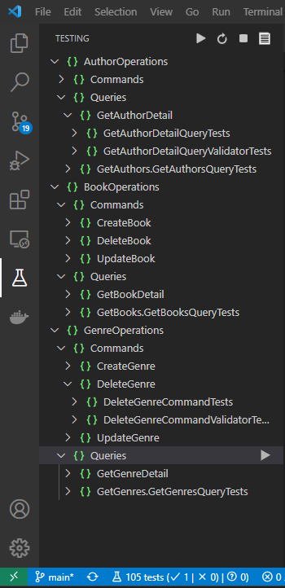

# Dotnet BookStore Project

* FluentValidation'ı kullanabilmiz için öncelikle kütüphaneyi paket olarak uygulamamıza eklememiz gerekir.

```.NET CLI
dotnet add package FluentValidation
```

Fluent Validation Kütüphanesi ile yapılabilecek hazır validasyonların tamamını [burdan](https://docs.fluentvalidation.net/en/latest/built-in-validators.html) inceleyebilirsiniz.

Inceleme Önerisi: Fluent Validation Kütüphanesi ile ilgili daha detay bilgi için [tıklayınız](https://docs.fluentvalidation.net/en/latest/installation.html).

* Kesin bir kural olmamakla birlikte middleware ler standart olarak Use prefix'i ile başlar.

Okuma Önerisi: Middleware ile igili data detaylı bilgi sahibi olabilmek için [buraya](https://learn.microsoft.com/en-us/aspnet/core/fundamentals/middleware/?view=aspnetcore-5.0) ve [buraya](https://www.gencayyildiz.com/blog/asp-net-core-2de-middleware-yapisi-ve-kullanimi/) tıklayınız.

* Json Serialize

```.NET CLI
dotnet add package Newtonsoft.Json
```

## ÖDEV - Projeye Author Controller ve Servislerin Eklenmesi

1. Projeye kitapların yazarları için Author controller'ı ekleyiniz. Bu controller ile aşağıdaki işlemlerin gerçeklenebilmesi gerekmektedir.

    * Yazar Ekleme
    * Yazar Bilgileri Güncelleme
    * Yazar Silme
    * Tüm Yazarları Listeleme
    * Spesifik Bir Yazarın Bilgilerini Getirme

2. Yazar Bilgileri:

    * Ad
    * Soyad
    * Doğum Tarihi

3. Kitap - Yazar - Tür entity ilişkilerini kurunuz. Bir kitabın yalnızca bir yazarı olabilir varsayımında bulunabilirsiniz.

    * Kitabı yayında olan bir yazar silinememeli. Öncelikle kitap silinmeli, daha sonra yazar silinebilir.

4. Author için model ve dto'ları ekleyiniz. Controller metotları entity'leri input veya output olarak kullanmamalı.

5. Author entity model map'lerini Auto Mapper kullanarak yazınız.

6. Author servisleri için Fluent Validation kullanarak validation sınıflarını yazınız. Kuralları uygun gördüğünüz şekilde belirleyebilirsiniz.

7. Servisler içerisinden anlamlı hata mesajları fırlatılmalı.

## Örnek Test Yazılması

1. Tüm test projelerini aynı dizinde tutmak için "Tests" isminde dizin oluşturulur.
2. Tests dizini içinde Unit Test projesi yaratılır. Biz örnekte xunit test proje şablonu kullanacağız. (Nunit yada MSTest kullanan şablonlar da mevcut.) Test projesi isimlendirme : (TestEdilecekProje).(TestTipi)Tests
3. Test projesi solutiona eklenir.
4. Test projesine, test için ihtiyaç duyulan diğer projeler referansı eklenir.
5. Test projesine, test için ihtiyaç duyulan test kütüphaneleri eklenir. Mocking için Moq, assertions için FluentAssertions kullanacağız.
6. Hazırlıklar tamam, solution re-build alalım.
7. Henüz test yazmadan bir test edelim. Projeyi oluşturunca default gelen 1 tane test var içi boş, bu yüzden passed olduğu için 1 passed test geliyor.
8. Dotnet test komutu dışında VSCode'da ".NET Core Test Explorer" extensionı ile de gösterilebilir.
9. Yeni bir test ekleme (Fact'in önemi, kullanılan frameworke göre değişir.)
10. Bağımlılık olmayan bir class için test eklenir. İsimlendirme ve AAA şablonuna dikkat edilmeli. Tek bir koşul test edilmeli.
    Her bir unit test çoğunlukla, Arrange (Hazırlama) - Act (Çalıştırma) - Assert (Doğrulama) kısaca AAA şablonu ile 3 aşamadan oluşur. Bu 3 aşamanın anlamları kısaca aşağıdaki gibidir:

     * Arrange (Hazırlama) : Bu aşamada test edilecek birimin çalışabilmesi için gerekli hazırlıklar yapılır. İhtiyaç duyulan parametreler, bağımlılıklar için taklitler oluşturulur. Test edilecek birimin hazırlık aşamasına ihtiyacı yok ise bu adım atlanılabilir.
     * Act (Çalıştırma) : Bu aşamada test edilen birim çalıştırılır. Test edilen birimi bir method olarak düşünürsek bu adımda method çağrımı yapılır. Methodun ihtiyaç duyduğu parametreler, methodu barındıran sınıfın bağımlılıkları Arrange adımında hazırlanmış olmalıdır. Bu adımda yalnızca çalıştırma işlemi yapılır ve eğer var ise geri dönüş nesnesi bir değişkene atanır.
     * Assert (Doğrulama) : Bu aşamada test edilen birimin davranışı doğrulanır. Doğrulama işlemi büyük çoğunlukla geri dönüş nesnesinin doğrulanması ile yapılır. Eğer hata(exception) durumlarını test ediyosak bu aşamada beklenen tipte bir exception fırlatıldığının da doğrulaması yapılır. Gerekli durumlarda bağımlılıklar için oluşturulmuş sahte nesneler ile olan iletişim de bu adımda doğrulanabilir.

11. Bağımlılık olan bir class için test eklenir. Taklit nesne (mocking) gösterilir. Interface önemi.
12. Belki örnek Theory gösterilebilir.

```.NET CLI
mkdir Tests
cd Tests
dotnet new xunit -n WebApi.UnitTests
cd ..
dotnet sln add Tests/WebApi.UnitTests
cd Tests/WebApi.UnitTests
dotnet add reference ../../WebApi
dotnet add package Moq
dotnet add package FluentAssertions
cd ..
cd ..
dotnet clean
dotnet build
dotnet test
```

## Token Bazlı Kimlik Doğrulama

```.NETCLI
dotnet add package Microsoft.AspNetCore.Authentication.JwtBearer
```

## Ödev - Unit Test

1. Book servislerinin eksik birim testlerini tamamlayınız.

    * DeleteBookCommand
    * DeleteBookCommandValidator
    * UpdateBookCommand
    * UpdateBookCommandValidator
    * GetBookDetailQuery
    * GetBookDetailQueryValidator

2. Genre servislerinin birim testlerini yazınız.

    * CreateGenreCommand
    * CreateGenreCommandValidator
    * DeleteGenreCommand
    * DeleteGenreCommandValidator
    * UpdateGenreCommand
    * UpdateGenreCommandValidator
    * GetGenreDetailQuery
    * GetGenreDetailQueryValidator

3. Daha ödevler kapsamında yazmış olduğunuz author servislerinin birim testlerini yazınız.


