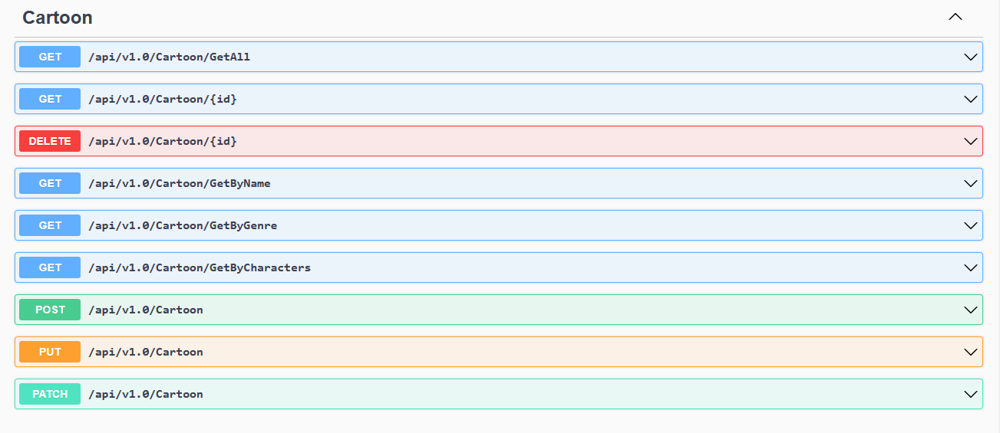

# Restful Api Geliştirin

* Rest standartlarna uygun olmalıdır.
* GET,POST,PUT,DELETE,PATCH methodları kullanılmalıdır.
* Http status code standartlarına uyulmalıdır. Error Handler ile 500, 400, 404, 200, 201 hatalarının standart format ile verilmesi.
* Modellerde zorunlu alanların kontrolü yapılmalıdır.
* Routing kullanılmalıdır.
* Model binding işlemleri hem body den hemde query den yapılacak şekilde örneklendirilmelidir.
* Bonus: Standart crud işlemlerine ek olarak, listeleme ve sıralama işlevleride eklenmelidir. Örn: /api/products/list?name=abc

## 2.Ödev

* İlk hafta geliştirdiğiniz api kullanılacaktır.
* Rest standartlarına uygun olmalıdır.
* Solid prensiplerine uyulmalıdır.
* Fake servisler geliştirilerek Dependency injection kullanılmalıdır.
* Api’ nizde kullanılmak üzere extension geliştirin.
* Projede swagger implementasyonu gerçekleştirilmelidir.
* Global loglama yapan bir middleware(sadece actiona girildi gibi çok basit düzeyde)
* Bonus: Fake bir kullanıcı giriş sistemi yapın ve custom bir attribute ile bunu kontrol edin.Global exception middleware i oluşturun.

## AutoMapper eklemek için konsoldan aşağıdaki kodu çalıştırınız

```.NET CLI
dotnet add package AutoMapper.Extensions.Microsoft.DependencyInjection
```

## Projenin Kullanımı



* Endpointler yukarıdaki resimdeki gibidir. Swagger ile rahat bir şekilde bu fonksiyonları kullanıp deneyebilirsiniz.
